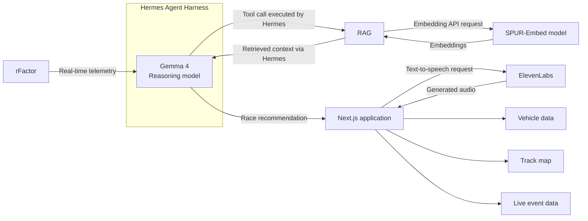

# PIT//CALL — Build With Gemma Hackathon

PIT//CALL is a real-time race-strategy co-pilot created for the [Build With Gemma: Triage in Light Speed](https://www.kaggle.com/competitions/build-with-gemma-triage-in-light-speed/overview) Kaggle competition, Pit Lane Telemetry track.

The system receives live telemetry generated by **rFactor**, uses **Gemma 4** inside a **Hermes agent harness** to interpret the race state, and returns an explainable recommendation through a **Next.js** application. Recommendations can be delivered visually or converted to speech through **ElevenLabs**.

Typical calls include:

- **BOX**
- **STAY OUT**
- **MANAGE TYRES**
- **LIFT & COAST**

The central design principle is that no single component makes the system work alone. rFactor supplies the changing race environment, deterministic tools calculate measurable conditions, RAG retrieves supporting knowledge, Hermes manages the agent loop, and Gemma synthesizes the final recommendation.

## System architecture



## End-to-end workflow

1. **rFactor generates live telemetry.** The simulator produces continuously changing vehicle and session data during an active race.
2. **The telemetry is structured for the agent.** The system selects and formats the current race state instead of sending an uncontrolled raw stream to the language model.
3. **Hermes manages the agent workflow.** Hermes provides Gemma with its instructions, telemetry context, conversation state, and available tools.
4. **Gemma 4 interprets the situation.** Gemma determines whether it can answer from the available context or needs additional evidence.
5. **Hermes executes tool calls.** Tools can perform deterministic analysis or retrieve relevant information through RAG.
6. **RAG retrieves supporting knowledge.** SPUR-Embed creates the embeddings used to find material relevant to the current query.
7. **Gemma produces the final recommendation.** The answer combines the live race state with the returned tool evidence.
8. **The Next.js backend receives the result.** The backend provides a controlled boundary between the agent and the user interface.
9. **The interface presents the decision.** The dashboard combines vehicle information, circuit context, live event data, and the AI recommendation.
10. **Next.js optionally requests speech.** ElevenLabs converts the completed recommendation into audio without becoming part of the reasoning loop.

## How Gemma 4 was utilized

Gemma 4 is the system's reasoning and communication model. It operates inside the Hermes agent harness rather than as an isolated chatbot.

Gemma is responsible for:

- Interpreting the structured race state.
- Relating live conditions to racing knowledge.
- Determining when more information is required.
- Requesting tools through the Hermes harness.
- Synthesizing telemetry and retrieved evidence.
- Producing a concise, explainable race recommendation.

Gemma does **not** collect telemetry, calculate deterministic metrics, execute external tools, or render the application. Those responsibilities remain with rFactor, the analytics layer, Hermes, and Next.js. This separation reduces hallucination risk and keeps numerical operations auditable.

## Hermes as the agent harness

Hermes surrounds Gemma with the operational capabilities required for agent behaviour. It is both the agent harness and the tool-calling layer.

Hermes manages:

- System instructions and prompt assembly.
- Structured telemetry context.
- Conversation and execution state.
- Tool definitions available to Gemma.
- Execution of tool requests.
- Return of tool results to Gemma.
- Delivery of the completed recommendation to the Next.js backend.

The responsibility split is simple: **Gemma reasons; Hermes orchestrates**.

## Model-access progression

The working model integration resulted from three iterations.

### 1. Gemma 4 on Spur's website

We began by testing Gemma 4 through Spur's website. This helped validate the model for the race-strategy use case, but the full agent prompt reached the available context-window limit.

An agent request can contain system instructions, structured telemetry, tool definitions, conversation state, retrieved documents, and tool results. Together, these elements required more context than the initial environment could support.

### 2. Gemma 4 in Google AI Studio

We moved the workflow to Google AI Studio to continue testing. We then encountered another platform limit, preventing AI Studio from becoming the dependable runtime for the integrated prototype.

The exact limit is not stated here because its numerical value was not recorded. The final Kaggle write-up should add the observed token, request, or quota threshold only if it can be verified from the development session.

### 3. Gemma 4 through OpenRouter

We then switched model access to OpenRouter. This provided the successful inference path for Gemma 4 and allowed us to integrate the model with Hermes.

With OpenRouter, the system could complete the full agent loop:

1. Hermes assembled the current context and instructions.
2. Gemma 4 received the request through OpenRouter.
3. Gemma returned either a tool request or a final response.
4. Hermes executed any requested tool and returned the result.
5. Gemma generated the final recommendation.
6. Hermes delivered the recommendation to the Next.js backend.

This was the first access path that supported the complete workflow from live telemetry to application output.

## Retrieval-augmented generation

RAG gives the agent access to relevant racing knowledge without placing the complete knowledge base inside every prompt.

SPUR-Embed is used as the embedding model for retrieval. Source material is embedded and indexed in advance. At runtime, the current query is embedded, similar passages are identified, and only the most relevant context is returned to Gemma through Hermes.

This approach provides three benefits:

- It reduces unnecessary prompt growth.
- It makes supporting information traceable.
- It allows the knowledge base to change without retraining Gemma.

RAG supports Gemma; it does not make the final decision. Gemma still evaluates the retrieved information against the live race state.

## Engineering hurdles

### Context-window limitation

**Problem:** The complete agent context exceeded the available window when Gemma 4 was tested through Spur's website.

**Why it happened:** Telemetry, system instructions, tools, history, retrieved content, and tool outputs all compete for the same context budget.

**Resolution:** We changed the model-access path and used RAG to retrieve only context relevant to the current decision.

**Lesson:** Context management is a system-design problem. Sending more data is not automatically better; the input must be selected, structured, and prioritized.

### Google AI Studio platform limit

**Problem:** The second model-access environment introduced another usage constraint.

**Resolution:** We moved inference to OpenRouter while keeping Gemma 4 as the reasoning model.

**Lesson:** Model choice and provider choice are separate decisions. A suitable model can still be blocked by the operational limits of a particular access environment.

### Integrating a tool-using agent with Next.js

**Problem:** An agent does not always return one immediate response. Gemma may request a tool, wait for its result, and continue reasoning before returning the final recommendation.

**Resolution:** Hermes owns the complete agent loop and connects to the Next.js backend. The frontend receives the completed result through a stable application boundary rather than managing the internal tool sequence.

**Lesson:** Agent execution and interface rendering should remain separate. The backend hides orchestration complexity and protects model-provider credentials.

### Managing real-time telemetry context

**Problem:** rFactor produces a continuous stream, while a language model operates on bounded requests. Sending every telemetry value would increase latency and consume context without guaranteeing a better decision.

**Design response:** The application structures the current race state before it reaches Gemma. Deterministic processing handles measurement and calculation; Gemma receives the information required to interpret the situation.

**Lesson:** The model should receive decision-relevant state, not an unfiltered data stream.

### Maintaining clear component boundaries

**Problem:** Gemma, Hermes, RAG, and Next.js can appear to have overlapping responsibilities if the architecture is described imprecisely.

**Resolution:** Each component has one primary role:

- rFactor simulates.
- Deterministic tools calculate.
- Hermes orchestrates.
- Gemma reasons.
- RAG retrieves.
- Next.js integrates and presents.
- ElevenLabs generates speech.

## Design choices

### rFactor instead of static input

We used rFactor because race strategy depends on conditions that change over time. It provides live, repeatable simulation telemetry rather than a prewritten scenario.

rFactor data should be described accurately: it is real-time data generated by a racing simulator, not proprietary telemetry from a real Formula 1 vehicle.

### Hermes instead of a single Gemma request

A single model call can only use information already included in its prompt. Hermes allows Gemma to request external tools, receive the results, and continue reasoning in a controlled loop.

### Deterministic analytics for measurable conditions

Arithmetic and threshold-based analysis should remain in conventional code wherever possible. This keeps calculations repeatable and allows the final recommendation to cite evidence rather than relying on unsupported model estimates.

### RAG instead of fine-tuning

RAG allows racing knowledge to be updated independently and retrieved only when relevant. It was more appropriate for the prototype than fine-tuning Gemma and helped reduce the amount of reference material placed into each prompt.

### OpenRouter as the inference path

OpenRouter was chosen after the previous environments prevented the complete workflow from running within their available limits. It allowed the team to continue using Gemma 4 instead of redesigning the project around a different reasoning model.

### Next.js backend as the integration boundary

The Hermes agent connects to the backend rather than directly to the browser. This protects credentials, centralizes request handling, and gives the interface a predictable response contract.

### Voice outside the reasoning path

ElevenLabs is called by Next.js after the recommendation is complete. The visual decision can be shown immediately, while audio is generated as a secondary output.

## Project structure

The implementation separates analytics, retrieval, orchestration, and presentation:

```text
tools.py             Deterministic race-analysis tools and retrieval functions
orchestrator.py      Hermes/Gemma agent workflow and tool orchestration
rag/                 Racing knowledge corpus, embedding, and retrieval index
web/server.py        Backend service boundary for the agent workflow
web/static/          Initial browser-based proof of concept
frontend/            Next.js application and backend Route Handlers
```

The Next.js application is the primary user experience. The earlier static interface remains useful as an end-to-end proof of concept.

## Setup

### Backend

```bash
pip install -r requirements.txt
python3 rag/build_index.py
cd web
python3 -m uvicorn server:app --port 8420
```

### Next.js application

Run the frontend in a second terminal:

```bash
cd frontend
npm install
npm run dev
```

The application is available at `http://localhost:3000` and communicates with the agent backend.

### Configuration

Credentials must be stored in a gitignored `.env` file and must never be committed. The deployment requires credentials for the configured services, including:

- OpenRouter for Gemma 4 inference.
- Spur for SPUR-Embed retrieval.
- ElevenLabs for optional voice generation.

The exact environment-variable names should match the implementation included in the repository.

## Current limitations

- rFactor supplies realistic simulation data, not real Formula 1 team telemetry.
- The exact limits encountered on Spur's website and Google AI Studio still need to be documented from verified records.
- External APIs introduce latency, quota, and availability dependencies.
- RAG quality depends on the coverage and accuracy of the indexed material.
- Language-model recommendations can be wrong and are not a replacement for validated race-engineering models.
- The system still requires broader testing across circuits, race states, and failure conditions.

## Evaluation

A complete evaluation should record the following for repeatable rFactor scenarios:

- Structured telemetry supplied to Hermes.
- Tools requested by Gemma.
- Evidence returned by the tools or RAG system.
- Final recommendation and confidence.
- Time from telemetry update to visual response.
- Additional time required for speech generation.
- Whether the recommendation was relevant and plausible.

A useful comparison is:

1. Gemma with telemetry only.
2. Gemma with telemetry and unfiltered reference material.
3. Gemma with telemetry, Hermes tool calling, and RAG.

This comparison can show whether agent orchestration and retrieval improve the result rather than merely adding complexity.

## Kaggle submission requirements

The submission requires:

1. **Kaggle write-up:** architecture, Gemma usage, engineering hurdles, and design choices.
2. **Live demonstration:** a hosted application, interactive notebook, or clear recording that judges can evaluate.
3. **Public repository:** reproducible source code, retained competition files, and clear documentation.

## Status

- [x] Live racing environment provided by rFactor.
- [x] Gemma 4 selected as the reasoning model.
- [x] Hermes used as the agent harness and tool-calling layer.
- [x] RAG retrieval integrated with SPUR-Embed.
- [x] Gemma 4 accessed successfully through OpenRouter.
- [x] Hermes agent connected to the Next.js backend.
- [x] Vehicle, track, and live event information represented in the interface.
- [x] ElevenLabs included as the optional voice-output service.
- [ ] Add verified context-window and platform-limit measurements.
- [ ] Record end-to-end latency across representative rFactor scenarios.
- [ ] Deploy a publicly reachable live demo.
- [ ] Complete the final Kaggle write-up and supporting video.

## Conclusion

PIT//CALL demonstrates how Gemma 4 can operate as the reasoning component of a real-time, tool-using race-strategy system. The project combines live rFactor telemetry, Hermes orchestration, deterministic analysis, RAG retrieval, a Next.js interface, and optional speech output.

The most important engineering result was not simply producing a model response. It was finding an infrastructure path that could support the complete workflow. The team progressed from Spur's website to Google AI Studio and finally to OpenRouter, where Gemma 4 and Hermes could operate together and connect successfully to the Next.js backend.
